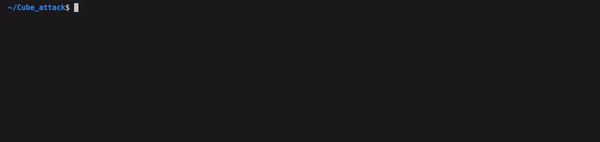
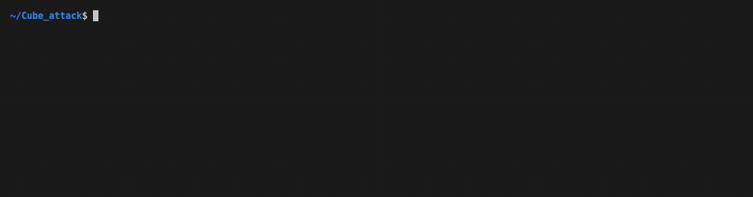

# CUDA_CubeAttack


## Overview

**CUDA_CubeAttack** aims to offer a flexible implementation of cube attack exploiting CUDA framework (sm_50).

## Break one of the ciphers in ./final_attack/ciphers_lib

Choose the proper bit/byte ordering in *cipher.cu* and *validator.py* file, 
setting the proper public and private key size.

Copy cipher's code in **cipher.cu** until the bottom delimiter.

Then just uncomment one of following lines in *IV_gen* and *IV_gen_host* functions:

```C
...
iv[(cube_index[i]/8)] += to_MSB(c_i * (1<<(cube_index[i]%8))); //Trivium
//iv[(IV_dim-1)-(cube_index[i]/8)] += to_MSB(c_i * (1<<(cube_index[i]%8))); // Grain
//iv[(cube_index[i]/8)] += (c_i * (1<<((cube_index[i]%8)))); // Morus
...
```

choose the same order in *key_gen_superpoly_reconstruction*:

```C
...
//k_start[(tid/8)] = (1<<(pos%8)); // Morus
k_start[(tid/8)] = to_MSB(1<<(pos%8)); // Trivium
//k_start[(K_dim-1) - (tid/8)] = to_MSB(1<<7-(pos%8)); //Grain 
...
```

and finally edit **validator.py**:


```Python3
...
bin_assignment = reduce(lambda x,y:x+y,[('0'*(8-len(bin(c).split('b')[1]))+bin(c).split('b')[1]) for c in ks]) # this depends on the cipher, OK for Trivium
#bin_assignment = reduce(lambda x,y:x+y,[('0'*(8-len(bin(c).split('b')[1]))+bin(c).split('b')[1])[::-1] for c in ks]) # this depends on the cipher, OK for MORUS
#bin_assignment = reduce(lambda x,y:x+y,[('0'*(8-len(bin(c).split('b')[1]))+bin(c).split('b')[1])[::-1] for c in ks][::-1]) # this depends on the cipher, OK for Grain
...
```

Remember to set the proper *K_dim*.


## Usage 

Once set the proper *N_ROUND* in **cipehr.cu**, after choosing the proper output bit position through *BIT_POSITION_APP* and *BIT_POSITION*, you can call **launch_attack.sh** as follow:


<p align='left'>

</p>


Then two files are produced:
* **cubes_test.txt**
* **superpolies.txt**

Where the line position links each *maxterm* with the corresponding *superpoly*.


Check results using *validator.py*:

<p align='left'>

</p>

## Attack a different cipher

To integrate new cipher's code in **cipher.cu** in order to attack new cipher function, the following function has to be implemented:
* *encrypt*: receive two byte arrays (public/private information), return a bit according to *BIT_POSITION_APP* and *BIT_POSITION*
* *encrypt_exploit*: receive only public key as parameter (the private key is in constant memory *d_key_2_guess*)

Then implement the corresponding host functions(*encrypt_host*, *encrypt_exploit_host*).

The following parameters must be defined according to cipher's specification:
* *K_dim*
* *IV_dim*

## Cube and superpolies verification

Checking literature results for cubes and superpolies. Write the candidate *maxterm* in *maxterm.txt* in *offline* subdirectory (indexing start from 0).

Select one of the ordering in **cipher.cu**, call **./final_attack/offline/superpoly_rec/att1** and check in *superpolies_window.txt* the superpolies obtained.

The right ordering will generate the same published superpolies.

## Use different maxterm version

From **launch_attack.sh** you can select one of the following *maxterm mining* versions:

* version 5: trivial parallelized version without huge cube support 
* version 6: proposed parallelized version without huge cube support
* version 7: trivial parallelized version with arbitrary huge cube support 

## Results 

Results against Trivium, Morus-640-128 and Grain-128AEAD are reported [here](/docs/MasterThesis.pdf).


